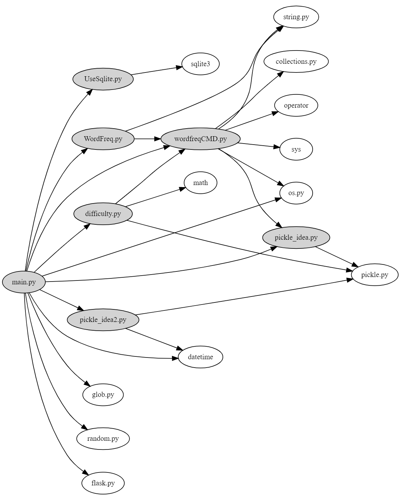
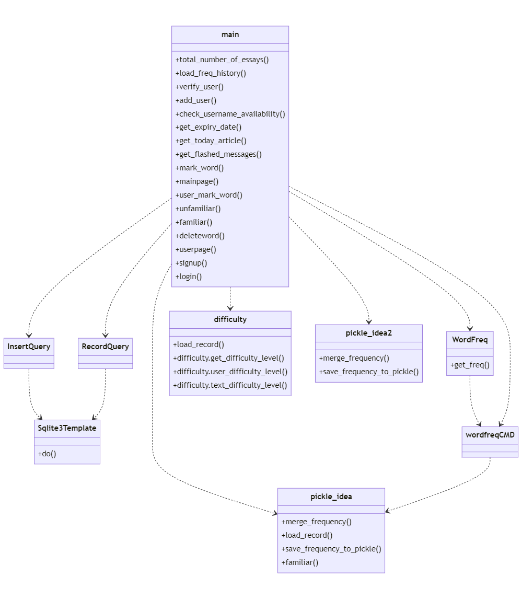

EnglishPal Dependency Analysis and Dependency Graph
===================================

Author：201932110102，201932110101，201932110109，201932110108

Date：2021/11/30

Abstract
--------
Do search on the denpencies of EnglishPal-master,to help us learn the code architecture well.
We use snakefood to generate the module-level dependency graph,and mermaid to help generate class/function-level dependency.

Introduction
--------
EnglishPal-master is a website application used to help English learners improve their reading level and recite new words. The lab analyzed the health status of the EnglishPal’s current architecture with the help of module-level dependency and class/function-level dependency.

Materials and Methods
--------
The module-level dependencies graph of English graph is generated by snakefood, and the class or function-level dependency graph is drawn by ourselves.Mermaid can help to generate the  class or function-level dependency graph.

Results
--------
1.The module-level dependencies： 
::

      strict digraph "dependencies" {
      graph [
              rankdir = "LR",
              overlap = "scale",
              size = "8,10",
              ratio = "fill",
              fontsize = "16",
              fontname = "Helvetica",
              clusterrank = "local"
              ]

             node [
                 fontsize=12
                 shape=ellipse
             ];

         "UseSqlite.py"  [style=filled];
         "UseSqlite.py" -> "sqlite3";
         "WordFreq.py"  [style=filled];
         "WordFreq.py" -> "wordfreqCMD.py";
         "WordFreq.py" -> "string.py";
         "difficulty.py"  [style=filled];
         "difficulty.py" -> "wordfreqCMD.py";
         "difficulty.py" -> "math";
         "difficulty.py" -> "pickle.py";
         "main.py"  [style=filled];
         "main.py" -> "UseSqlite.py";
         "main.py" -> "WordFreq.py";
         "main.py" -> "difficulty.py";
         "main.py" -> "pickle_idea.py";
         "main.py" -> "pickle_idea2.py";
         "main.py" -> "wordfreqCMD.py";
         "main.py" -> "datetime";
         "main.py" -> "glob.py";
         "main.py" -> "os.py";
         "main.py" -> "random.py";
         "main.py" -> "flask.py"
         "pickle_idea.py"  [style=filled];
         "pickle_idea.py" -> "pickle.py";
         "pickle_idea2.py"  [style=filled];
         "pickle_idea2.py" -> "datetime";
         "pickle_idea2.py" -> "pickle.py";
         "wordfreqCMD.py"  [style=filled];
         "wordfreqCMD.py" -> "pickle_idea.py";
         "wordfreqCMD.py" -> "collections.py";
         "wordfreqCMD.py" -> "operator";
         "wordfreqCMD.py" -> "os.py";
         "wordfreqCMD.py" -> "string.py";
         "wordfreqCMD.py" -> "sys";
         }

2.The class/function level dependencies:

::

      classDiagram
      InsertQuery ..> Sqlite3Template
      RecordQuery ..> Sqlite3Template
      WordFreq ..> wordfreqCMD
      main ..> InsertQuery
      main ..> RecordQuery
      main ..> WordFreq
      main ..> difficulty
      main ..> pickle_idea
      main ..> pickle_idea2
      main ..> wordfreqCMD
      wordfreqCMD ..> pickle_idea
      class main{
      +total_number_of_essays()
      +load_freq_history()
      +verify_user()
      +add_user()
      +check_username_availability()
      +get_expiry_date()
      +get_today_article()
      +get_flashed_messages()
      +mark_word()
      +mainpage()
      +user_mark_word()
      +unfamiliar()
      +familiar()
      +deleteword()
      +userpage()
      +signup()
      +login()
      }
      class difficulty{
       +load_record()
       +difficulty.get_difficulty_level()
       +difficulty.user_difficulty_level()
       +difficulty.text_difficulty_level()
      }
      class pickle_idea{
       +merge_frequency()
       +load_record()
       +save_frequency_to_pickle()
       +familiar()
      }
      class pickle_idea2{
       +merge_frequency()
       +save_frequency_to_pickle()
      }
      class Sqlite3Template{
       +do()
      }
      class WordFreq{
       +get_freq()
      }
   

3.Pros and cons of the current architecture of EnglishPal

Disadvantages: 

1)The speed of transferring picture or other media information between web pages is low. 

2)The server processes multiple requests at the same time, which reduces the operation efficiency. 

3)Code change and maintenance are difficult. 

      
Advantages: 

1)API has high security. 

2)Using syntax similar to the pattern for development makes the code readable. 

3)Simple crud and small code base are suitable for smaller projects. 

4)There is less communication between the front end and the back end, reducing the communication cost. 
      

Discussions
--------
During the lab, we learnt to use Snakefood, Graphviz Online, Mermaid as well as Read the Docs. We figured the current health status of the architecture of EnglishPal which can be conducive to the projects we may develop or improve in the future.

References
--------
Graphviz. https://graphviz.org/

Graphviz Online. https://bit.ly/3uYDiLV

Snakefood: Python Dependency Graphs. http://furius.ca/snakefood/

Mermaid. https://mermaid-js.github.io/mermaid/#/

Read the Docs. https://readthedocs.org/

Sofia Peterson. A Brief Guide How to Write a Computer Science Lab Report. https://thehackpost.com/a-brief-guide-how-to-write-a-computer-science-lab-report.html

